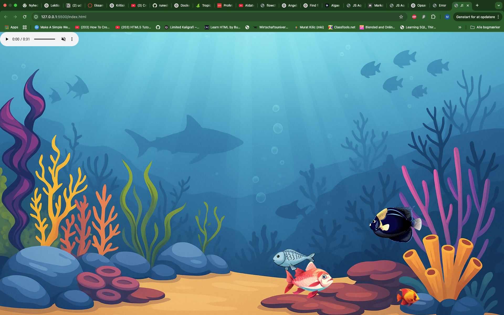
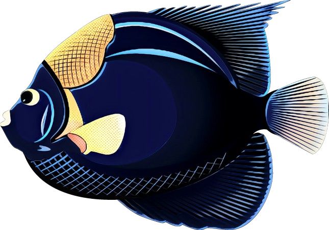
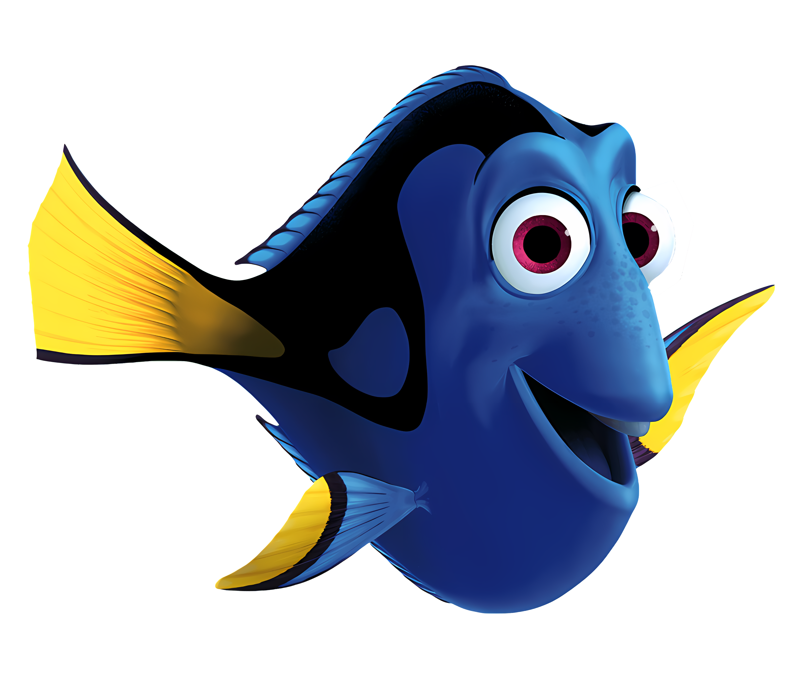
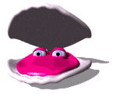
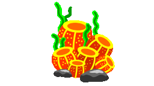

# 📚 Animating HTML-elements in a Aquarium with CSS animation and JavaScript Events

---




## 🛠️ Before You Start

Before beginning this exercise, make sure to **fork the repository** so that you are working on your own copy.

### How to fork a repository on GitHub.com

1. Click the **Fork** icon in the upper right corner of the repository page.
2. On the next screen, click the green **Create fork** button to make your own copy.
3. After the fork is created, click the green **Code** button and select **Open with GitHub Desktop**.
4. In **GitHub Desktop**, choose a **Local Path** where you want to store the repository on your computer.
5. When prompted **"How do you plan to use this fork?"**, select **"For my own purposes"** and continue.

---

### 🔁 Commit Frequently!

For each step in this exercise, you are required to:

✅ Make at least **one commit per step**  
✅ Write a clear and meaningful **commit message** (e.g., "Added second red fish", "Inserted anchor image with tooltip")

This helps you track your progress and is good practice for real-world development workflows.

## 🖌️ Module 1 – Extend the Markup with More Elements

### 🎯 Learning Goals

- Practice working with existing HTML markup.
- Learn how to insert additional HTML elements using correct syntax.
- Understand the use of `class` and `id` attributes.
- Prepare the aquarium for upcoming interactivity using JavaScript and CSS.

---

Your current HTML includes the following:

```html





<audio controls muted loop>
  <source src="audio/indoor-aquarium-sound.ogg" type="audio/ogg" />
  <source src="audio/indoor-aquarium-sound.mp3" type="audio/mpeg" />
  Your browser does not support the audio element.
</audio>
```

#### ✏️ Step 1.1 – Add an additional red fish element

```html

```

✅ Commit your changes:

#### 🐠 Step 1.2 – Add a blue fish element

```html

```

✅ Commit your changes:

#### 🐡 Step 1.3 – Add tropical fish elements with unique IDs

Insert three tropical fish like this:

```html


```

✅ Commit your changes:

#### 🐳 Step 1.4 – Add more cod fish elements with unique IDs

The aquarium needs more cod! Add the following under the existing one:

```html


```

✅ Commit your changes:

#### 🐚 Step 1.5 – Add sea clams

These bring more life to the sea floor:

```html


```

✅ Commit your changes:

#### 🌿 Step 1.6 – Add underwater plants

Add algae and seaweed for background detail:

```html


```

✅ Commit your changes:

---

## 🖌️ Module 2 – Styling HTML Elements and Adding CSS Animations

### 🎯 Learning Goals

- Extend and customize the existing CSS stylesheet.
- Position additional fish and sea elements in the aquarium.
- Add unique animations to specific fish.
- Understand how to use `@keyframes`, `position`, `bottom`, `left`, and `right`.

---

### 💡 Important Note

Some styling has already been provided in your starter CSS file (`initial-aquarium-style.css`), including:

✅ Font import and base resets  
✅ Background setup for the `.bg` container  
✅ Initial styles for the red fish (`#redfish`), orange fish, flat blue fish, and one codfish  
✅ Some predefined animations like `zigzag` and `arcLeftMotion`

In this module, you’ll build on top of that and add styles and animations for the remaining fish and decorations.

#### 🧱 Step 2.1 – Style the second red fish

In your CSS file, add the following under the existing redfish style:

```css
#redfish2 {
  z-index: auto;
  bottom: 140px;
  left: -200px;
  max-width: 320px;
  animation: swim 11s linear infinite;
}
```

✅ Commit your changes:

#### 🐟 Step 2.2 – Style the bluefish

Add this style for the bluefish image itself:

```css
.bluefish {
  max-width: 200px;
  position: relative;
  z-index: 1;
}
```

✅ Commit your changes:

#### 🐡 Step 2.3 – Style additional codfish

Style the remaining codfish elements:

```css
#codfish2 {
  bottom: 63px;
  right: -170px;
  animation: arcLeftMotion 18s linear infinite;
}

#codfish3 {
  bottom: 13px;
  right: -160px;
  animation: arcLeftMotion 19s linear infinite;
}

#codfish4 {
  bottom: 13px;
  right: -48px;
  animation: arcLeftMotion 22s linear infinite;
}

#codfish5 {
  bottom: 43px;
  right: -38px;
  animation: arcLeftMotion 23s linear infinite;
}
```

✅ Commit your changes:

#### 🐠 Step 2.4 – Style tropical fish

```css
#tropicalfish1 {
  bottom: 230px;
  right: -200px;
  width: 100px;
  height: 94px;
  animation: arcLeftMotion 17s linear infinite;
}

#tropicalfish2 {
  bottom: 245px;
  right: -200px;
  width: 100px;
  height: 94px;
  animation: arcLeftMotion 14s linear infinite;
}

#tropicalfish3 {
  bottom: 260px;
  right: -200px;
  width: 100px;
  height: 94px;
  animation: arcLeftMotion 20s linear infinite;
}
```

✅ Commit your changes:

#### 🌿 Step 2.5 – Style clams, algae, and seaweed

```css
.small-clam {
  z-index: auto;
  bottom: 20px;
  right: 320px;
}

.big-clam {
  z-index: auto;
  bottom: -7px;
  left: 746px;
}

.seaweed {
  z-index: auto;
  bottom: -10px;
  right: 880px;
  width: 215px;
  height: 180px;
}

.algae {
  z-index: auto;
  bottom: -10px;
  right: 580px;
  width: 140px;
  height: 300px;
}
```

✅ Commit your changes:

#### ⚓ Step 2.6 – Style the anchor

```css
.anchor {
  z-index: auto;
  bottom: 1px;
  left: 445px;
  width: 120px;
  height: 165px;
}
```

✅ Commit your changes:

#### 🎞️ Step 2.7 – Add missing animations

```css
@keyframes swim {
  0% {
    transform: translate(0px, 0px);
  }
  30% {
    transform: translate(300px, 0px);
  }
  60% {
    transform: translate(500px, -120px);
  }
  80% {
    transform: translate(1100px, 0px);
  }
  90% {
    transform: translate(1400px, 120px);
  }
  100% {
    transform: translate(2560px, -120px);
  }
}
```

✅ Commit your changes:

---

## 🧩 Module 3 – Interacting with the DOM (Make the Anchor Interactive)

### 🎯 Learning Goals

- Access and manipulate DOM elements using JavaScript
- React to user interactions with event listeners
- Update element styles and content dynamically
- Control audio playback with JavaScript

---

#### 🧩 Step 3.1 – Add the tooltip HTML element

Insert the following line **after the anchor image** inside the `.bg` container in your HTML:

```html
<div class="tooltip" id="anchor-tooltip">Klik for at afspille musik</div>
```

#### 🎨 Step 3.2 – Style the tooltip in CSS

Add this style block to your CSS file:

```css
#anchor-tooltip {
  position: absolute;
  background-color: #222;
  color: #fff;
  padding: 6px 10px;
  border-radius: 5px;
  font-size: 0.9rem;
  opacity: 0;
  transition: opacity 0.3s;
  pointer-events: none;
  z-index: 100;
}
```

✅ Commit your changes:

#### 🎯 3.3 – Set up a DOMContentLoaded event listener

In your `script.js` file, start by wrapping your logic in this structure:

```javascript
document.addEventListener("DOMContentLoaded", function () {
  // All JavaScript goes inside here
});
```

Then, inside this block above, select the relevant DOM elements:

```javascript
const anchor = document.querySelector(".anchor");
const anchorTooltip = document.getElementById("anchor-tooltip");
const audio = document.querySelector("audio");
```

✅ Commit your changes:

#### 🎯 Step 3.4 – Show the tooltip on mouseenter

Inside the DOMContentLoaded block, add this event listener:

```javascript
anchor.addEventListener("mouseenter", () => {
  const rect = anchor.getBoundingClientRect();
  anchorTooltip.style.opacity = "1";
  anchorTooltip.style.left = `${rect.left + 60}px`;
  anchorTooltip.style.top = `${rect.top - 30}px`;

  if (audio.paused) {
    anchorTooltip.innerText = "Klik for at starte musikken";
  } else {
    anchorTooltip.innerText = "Klik for at stoppe musikken";
  }
});
```

✅ Commit your changes:

> 💡 We use getBoundingClientRect() to position the tooltip next to the anchor based on its location in the browser window.

#### 🎯 Step 3.5 – Hide the tooltip on mouseleave

Now add another event that hides the tooltip when the user moves the mouse away:

```javascript
anchor.addEventListener("mouseleave", () => {
  anchorTooltip.style.opacity = "0";
});
```

✅ Commit your changes:

#### 🔊 Step 3.6 – Toggle audio on click

Finally, make the anchor control audio playback:

```javascript
anchor.addEventListener("click", () => {
  audio.muted = false;
  if (audio.paused) {
    audio.play();
  } else {
    audio.pause();
  }
});
```

✅ Commit your changes:

---

## 🐟 Module 4 – Click on a Fish to See Tooltip

### 🎯 Learning Goals

- Dynamically show a tooltip when clicking a fish
- Use JavaScript to access element classes and event data
- Work with structured data in an array (`fishInfo`)
- Show contextual content based on user input

---

#### 🧱 Step 4.1 – Update the HTML document

Before you can display tooltips for each fish, you need a reusable tooltip container in your HTML.

Add the following line **just before** the `<script>` tag at the bottom of your `index.html` file:

```html
<div id="tooltip" class="tooltip"></div>
```

✅ Commit your changes:

#### 🎨 Step 4.2 – Style the fish tooltip in CSS

Now go to your CSS file and make sure this styling is included for the #tooltip element.

```css
#tooltip {
  position: absolute;
  background-color: rgba(0, 0, 0, 0.75);
  color: white;
  padding: 6px 10px;
  border-radius: 6px;
  font-size: 14px;
  pointer-events: none;
  opacity: 0;
  transition: opacity 0.3s ease;
  z-index: 10;
}
```

✅ Commit your changes:

ℹ️ This makes the tooltip look like a small dark box with white text, hidden by default, and placed above the mouse when activated.

#### 💡 Step 4.3 – Select the tooltip element in JavaScript

Open your JavaScript file and locate the section where constants like anchor and audio are declared.

Right below those, add the following:

```javascript
const tooltip = document.getElementById("tooltip");
```

✅ Commit your changes:

#### 🐠 Step 4.4 – Click on a Fish to See Its Species and Age in a Tooltip

Now it’s time to loop through the fishInfo array and add click events to each fish on the screen.

Place this code inside your DOMContentLoaded event listener:

```javascript
fishInfo.forEach((fish) => {
  const fishElem = document.querySelectorAll("." + fish.className);

  fishElem.forEach((el) => {
    el.addEventListener("click", (e) => {
      tooltip.innerText = `${fish.art} — Alder: ${fish.alder}`;
      tooltip.style.top = `${e.pageY - 40}px`;
      tooltip.style.left = `${e.pageX + 20}px`;
      tooltip.style.opacity = "1";
      tooltip.style.fontSize = "1.15rem";

      // Hide tooltip after 3 seconds
      setTimeout(() => {
        tooltip.style.opacity = "0";
      }, 3000);
    });
  });
});
```

✅ Commit your changes:

🔍 What's Happening in This Code?

**fishInfo.forEach(...)**: Loops through each object in your fish data array.

**.querySelectorAll("." + fish.className)**: Finds all HTML elements that use the class name specified in the object (e.g., "redfish").

**.addEventListener("click", ...)**: When you click on a fish, a tooltip appears near the cursor.

**e.pageX / e.pageY**: These values give the exact position of the cursor on the screen, so the tooltip can appear nearby.

**.style.opacity = "1"**: Makes the tooltip visible.

**setTimeout(..., 3000)**: Automatically hides the tooltip after 3 seconds to avoid clutter.

---

## 🐡 Module 5 – Bonus: Expand Your Fish Data!

### 🧠 Learning Goals

- Enrich your JavaScript objects with more biological data
- Practice structuring and accessing complex data
- Improve tooltip design using real-world information
- Combine creativity, research, and code

---

**🔍 Introduction**

> Now that you can display a tooltip when clicking on a fish, it's time to make your aquarium more informative. In this bonus module, you'll upgrade the `fishInfo` array by researching **real facts** about the fish and presenting those in the tooltip.

#### 📚 Step 5.1 – Research Your Fish

Go online and search for more information about the fish in your aquarium. You can look for:

- 🧬 Latin name (scientific name)
- 📏 Typical or maximum length
- ⚖️ Typical or maximum weight
- 🌍 Natural habitat or location
- 🧓 Life expectancy or age

You don't need to find **everything**, but at least **3–4 facts** per fish would be great!

✅ Commit your changes:

#### 🧩 Step 5.2 – Update the `fishInfo` Array

Add new properties to each fish object. Here's an example with more data:

```javascript
{
  className: "redfish",
  art: "Rød Snapper",
  alder: "2 år",
  latinsknavn: "Lutjanus campechanus",
  længde: "Op til 100 cm",
  vægt: "Typisk 2–4 kg",
  levested: "Mexicanske Golf og det sydøstlige USA"
}
```

✅ Commit your changes:

#### 🛠️ Step 5.3 – Update the Tooltip Output

> Now modify your tooltip logic so that it shows more information. You can use either innerText or innerHTML. Here's a suggestion using HTML for better formatting:

```javscript
tooltip.innerHTML = `
  <strong>${fish.art}</strong><br>
  Latinsk navn: ${fish.latinsknavn}<br>
  Alder: ${fish.alder}<br>
  Længde: ${fish.længde}<br>
  Vægt: ${fish.vægt}<br>
  Levested: ${fish.levested}
`;
```

✅ Commit your changes:

Make sure this matches the new keys you added in fishInfo.

#### 🛠️ Step 5.4 – Style the Tooltip for a Better Visual Experience

> Now that your tooltip displays more detailed information, it’s time to make it **look like it belongs in the aquarium**.
> Open your CSS file and experiment with styles to make your tooltip more appealing and thematically consistent.
> Here are some ideas you can try:

##### 🎨 Suggestions for Enhancing the Tooltip:

- **💧 Add a background image**  
  Use a semi-transparent bubble image or light ocean texture to match the underwater theme.

- **🔤 Change the font styles**  
  Try using a playful or clean font, and adjust the size or color for headings vs. info lines.

- **📐 Add icons**  
  Consider using small icons (e.g. 🐟, 📏, ⚖️) for data like weight, size, or species.

- **🔲 Add a shadow or border**  
  Make the tooltip pop visually by adding a soft drop shadow or a rounded border.

---

## 🧪 Module 6 – Add at Least 3 More New Fish Elements

### 🎯 Learning Goals

- Add new visual elements to the DOM
- Apply new custom CSS animations
- Combine creativity with technical implementation
- Reinforce understanding of how HTML, CSS, and animation work together

---

#### 🐠 Step 6.1 – Add 3 New Fish Elements in HTML

In the `/img` folder of this project, you’ll find additional fish image files such as:

- `yellow-fish.png`
- `green-striped-fish.png`
- `purple-glowfish.png`

Choose at least **three** of them and insert them into your aquarium by adding new `` tags in the `.bg` container of your HTML file, for example:

```html


```

✅ Commit your changes:

#### 🎨 Step 6.2 – Create Unique Animations for Each New Fish

Now it's your turn to be creative!

Go to your CSS file and create at least **3 new custom `@keyframes` animations** that will bring your new fish to life.

> 🎯 Look at the existing animations like `zigzag`, `swim`, and `arcLeftMotion` in your CSS file. Observe how they are structured and how they affect the fish movement.

📌 Use those as inspiration and create your own keyframes with unique movement patterns (e.g. circular, bouncing, drifting, etc.).

✅ Commit your changes:

#### 🖼️ Step 6.3 – Apply Animations to the New Fish

Once you've defined your new animations, it's time to apply them to the fish you added in Step 6.1.

1. Add a new class selector for each of your fish in the CSS file.
2. Position the fish somewhere in the aquarium.
3. Use your newly created `@keyframes` animations on each fish.

> 💡 Again, take a look at how existing fish are styled and animated. Try inspecting them using DevTools or by exploring the CSS classes.

Once applied, refresh your browser and admire your new, uniquely animated fish!

✅ Commit your changes:
